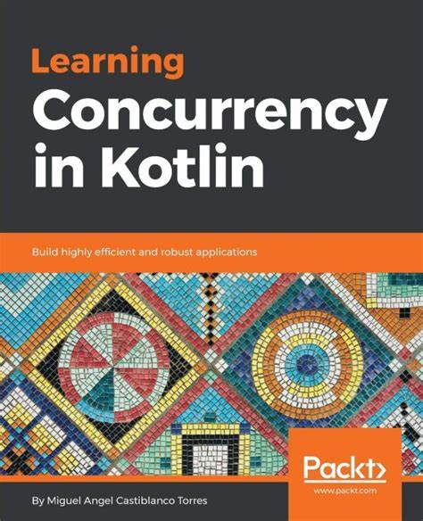

## 这是一个例子

## i am h2 sized 

#### i am h4 sized

[link to baidu](https://www.baidu.com)

[link to second markdown file ](./iu.md)

----





```ruby
print(it code block with ruby)
```

```C
#include<stdio.h>
int main()
```
> i am quote

* bullet list

* cold day

1. warm
2. not cold


---
|who | care |
|------ | -----|
|not| part|
---

**i am bolded text 我被加粗了**

*i am italic text 我是斜体*

~~i am deleted~~

---


